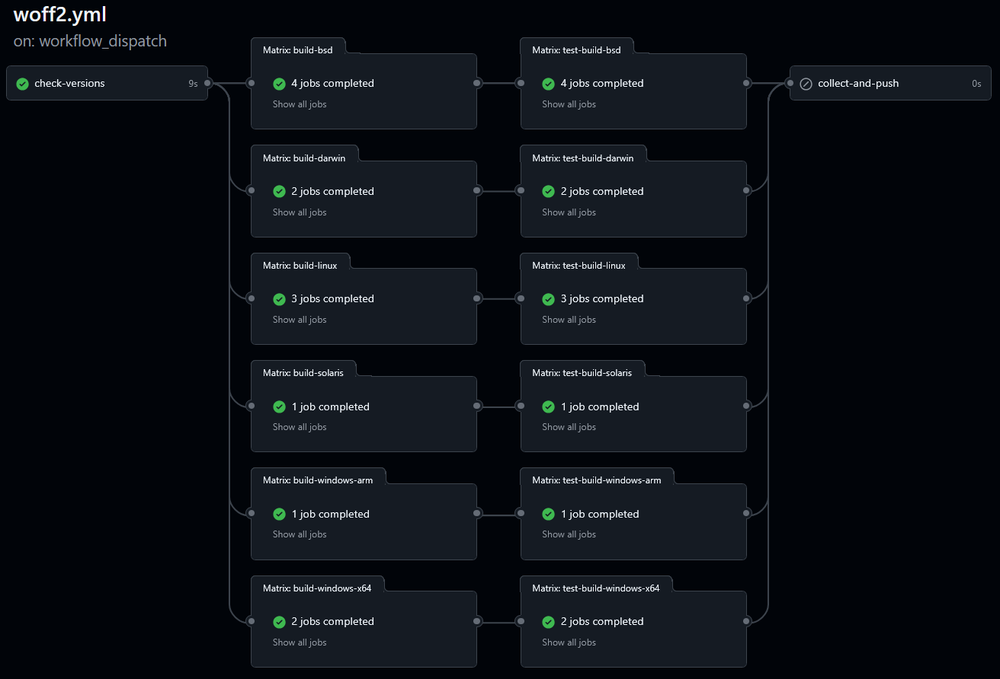

# Un peu de contexte

Nous réalisons différents projets de développement autour de la spécification XSL-FO, que nous publions en sources ouvertes (OpenSource). Pour le dire en deux mots, XSL-FO permet notamment de générer des documents PDF.
Dans le cadre de ces développements, il nous arrive d'avoir besoin de certains utilitaires, qui, la plupart du temps, sont disponibles sous la forme de packages directement en ligne. Quand un package nous plait, il suffit de l'intégrer à notre projet avec une ligne de code, et le tour est joué.  

Dans ce cas précis, nous cherchions à valider les polices de caractères détectées par l'option `auto-detect` d'Apache FOP[1]. Apache FOP se base sur le nom de la police, le fichier qui la contient, la graisse de la police, et si elle est en gras ou en italique (ou aucun des deux). Cela nous aurait permis de comparer le fonctionnement de cette option à d'autres implémentations de XSL-FO.

Un exemple de configuration d'Apache FOP avec uniquement la partie qui nous intéresse dans le cas précis. Les textes en français sont des commentaires pour faciliter la compréhension :
```xml
<renderers>
  <renderer mime="application/pdf">
     <fonts>
        <!-- Enregistre toutes les polices du dossier "C:\MyFonts1" -->
        <directory>C:\MyFonts1</directory>

        <!-- Enregistre toutes les polices du dossier "C:\MyFonts2" et ses sous-dossiers -->
        <directory recursive="true">C:\MyFonts2</directory>

        <!-- Détecte automatiquement les polices installées dans le système d'exploitation -->
        <auto-detect/>

        <!-- 
            On peut aussi préciser des polices comme ceci, avec le nom de fichier, 
            leur nom, leur style...
        -->
        <font metrics-url="arial.xml" kerning="yes" embed-url="arial.ttf">
            <font-triplet name="Arial" style="normal" weight="normal"/>
            <font-triplet name="ArialMT" style="normal" weight="normal"/>
        </font>
     </fonts>
  </renderer>
</renderers>
```

**Note** : Ce code provient de ces deux pages de documentation :
- [https://xmlgraphics.apache.org/fop/2.1/fonts.html#bulk](https://xmlgraphics.apache.org/fop/2.1/fonts.html#bulk)
- [https://xmlgraphics.apache.org/fop/2.11/configuration.html#renderers](https://xmlgraphics.apache.org/fop/2.11/configuration.html#renderers)

Pour valider ces options, nous recherchions donc un package permettant de récupérer automatiquement les polices de caractères fournies avec le système d'exploitation (l'équivalent de l'option `<auto-detect>`), et éventuellement d'y adjoindre une liste de dossiers arbitraires (l'équipe de l'option `<directory>`). Et on n'a rien trouvé de vraiment pertinent.  

Par "vraiment pertinent", il faut comprendre notre procédure pour intégrer du code externe. On vérifie toujours si un package est réellement pertinents dans notre contexte, notamment :
- La performance
- Les mises à jour fréquentes si le projet le nécessite
- Le nombre de téléchargements élevé. S'il est faible, on regarde le code source de la bibliothèque

Ces vérifications sont nécessaires, parce qu'il est toujours difficile de supprimer une dépendance une fois devenue une brique fondamentale d'un projet. En étant précautionneux, on gagne du temps pour l'avenir et on réduit la dette technique.  

En tout état de cause, le seul package trouvé était [Phenx PHP Font Lib](https://packagist.org/packages/phenx/php-font-lib) mais deux problèmes de taille ont surgi :
- Un problème de performance : ce package est très lent pour notre usage, parce qu'il récupère de nombreuses informations dont nous n'avons pas besoin
- Un problème de fonctionnalité : ce package ne gère qu'une petite partie des polices existantes ; TTF (TrueTypeFont), OTF (OpenTypeFont), WOFF (WebOpenFontFormat). Nous avons besoin à minima des polices WOFF2 et TrueTypeCollection en plus de celles-ci.

Après cette recherche, nous nous sommes dit que nous pourrions créer notre propre code et le rendre disponible sous la forme d'un package : ça ne devrait pas être bien long pour notre cas !  

*Haha*.  

# Première étape : se baser sur le code d'Apache FOP

Quand on souhaite porter une fonctionnalité d'un outil existant dans un autre langage, transposer le code est souvent la meilleure option. Dans le cas d'Apache FOP, c'est un outil qui existe depuis 1999, avec une communauté qui effectue toujours des mises à jour. L'outil est stable et fonctionnel, c'est pile ce qu'il nous faut.  

Le code d'Apache FOP est disponible à cet endroit pour Windows[2]. Et globalement, nous avons repris la partie du code qui nous intéressait à l'identique.  
De même pour le code associé aux systèmes d'exploitations macOS (Darwin) et Linux. Cependant, nous n'avons pas trouvé dans le code d'Apache FOP les environnements BSD et Solaris, renvoyées par la constante `PHP_OS_fAMILY`. Ce n'était pas grand chose, donc après un peu de recherches, nous avons inclus ces environnements à la bibliothèque.

# Deuxième étape : ajouter WOFF2

Le format WOFF2 est très intéressant dans le monde informatique moderne, pour son poids très faible. Chaque fichier ne peut contenir qu'une seule police de type TrueType ou OpenType. Sur Wikipedia, on peut voir ce paragraphe[3] en anglais :
> WOFF 2.0 significantly improved compression efficiency compared to WOFF 1.0, primarily through the introduction of Brotli, a new byte-level compression algorithm developed by Jyrki Alakuijala and Zoltan Szabadka. Brotli's effectiveness led to its widespread adoption, notably for HTTP content encoding. WOFF 2.0 was standardized as a W3C Recommendation in March 2018, with Google providing the reference implementation.

Pour obtenir la (ou les) police(s) dans un fichier WOFF2, il nous faut donc décompresser le fichier, puis passer le résultat à un détecteur TrueType ou OpenType. Après un peu de recherches, il nous faut l'outil `woff2_decompress` qui n'existe en accès libre que pour un environnement macOS ou Linux. C'est embêtant après avoir un système fonctionnant sur Windows, BSD et Solaris. Les sources sont disponibles, il ne reste qu'à les compiler pour chacun des environnements.  

Vient donc la création du fichier [woff2.yml](../.github/workflows/woff2.yml) : ce qu'on appelle communément une *pipeline*, un fichier contenant toutes les actions à faire sur des serveurs fournis par GitHub. Les objectifs principaux de cette pipeline :
- Pour chaque environnement, compiler `woff2_decompress`
- Pour chaque environnement, vérifier `woff2_decompress` (c'est important de vérifier)
- Pour chaque environnement, copier `woff2_decompress` dans ce package

Mais un environnement, ce n'est pas qu'un système d'exploitation, c'est aussi une architecture ! Pour ne donner que quelques exemples : Windows fonctionne en 32-bits, en 64-bits, en ARM, il existe les processeurs Mac Intel et les nouvelles puces M-quelque chose (M1, M2, ...). Bref, ce n'est pas une compilation, mais treize compilations !  

Résultat, la pipeline se présente comme ceci : on vérifie d'abord si le code de Woff2 a changé, puis on construit pour tous les environnements (les `Matrix`), puis on vérifie, puis on envoie les exécutables dans l'outil développé.



Pour être honnêtes, il y a pas mal de choses à dire à ce sujet, mais restons concis :
- Le code source de woff2_decompress fourni par Google est demandé de nombreuses fois pour Windows, mais à chaque fois la réponse vient de la communauté : Google semble avoir délaissé ce dépôt. Exemples : [1](https://github.com/google/woff2/issues/167), [2](https://github.com/google/woff2/issues/161), [3](https://github.com/google/woff2/issues/146). Nous aurions pu intégrer ces fichiers dans notre package, mais il était important pour nous de fournir les binaires de manière transparente, c'est à dire avec une *pipeline* ; télécharger un fichier exécutable sans savoir comment celui-ci a été construit nous semble délicat. Et cela n'aurait de toute façon fonctionné que sous Windows.
- Les manières de compiler selon les environnements sont assez proches, mais différentes malgré tout. On a passé pas mal de temps à rechercher pourquoi sur tel environnement, la compilation ne fonctionnait pas. Il a fallu aussi naviguer au travers des conseils simplistes d'utiliser [Act](https://github.com/nektos/act) : si cela marche très bien pour Linux, ce n'est pas le cas pour MacOS (qui ne peut être émulé par Act), Solaris ou BSD (Act n'est visiblement pas prévu pour, car il utilise des commandes qui n'existent pas par défaut sur ces systèmes). Nous nous sommes posés la question de cacher ces tentatives de compilation, mais nous avons décidé de les laisser en toute transparence : si cela peut vous servir, n'hésitez pas à vous rendre dans l'historique d'exécution de la *pipeline*.
- Nous avons essayé des modèles de langage (ChatGPT et Copilot) et les avons appliqués aux *pipelines*, par curiosité ou quand nous étions sans solution sur le moment. En résumé, pour une réponse valide à une question précise, environ cinq ajoutaient des options inutiles, ou changeaient le fonctionnement, ou inventaient des outils inexistants. Le gain de temps aura été évidemment négatif, mais des fois, il ne s'agit pas de produire mais de trouver de nouvelles pistes pour avancer.  

A la fin de cette étape, nous pouvions décompresser les fichiers WOFF2, ce qui nous laisse avec... un fichier TTF ou OTF !

# Troisième étape : ajouter TTF et OTF

Pour organiser un peu le développement, nous avons donc créé une structure de code standardisée appelée "décodeur", et chaque décodeur s'occupera d'un format. On aura donc un décodeur pour WOFF2, un pour TTF, un pour OTF, un pour TTC. Et chaque décodeur aura deux méthodes :
- `canExecute` : est-ce que le décodeur peut s'exécuter sur ce fichier, ou dit autrement, est-ce que le fichier correspond à ce décodeur
- `extractFontMeta` : si `canExecute` est positif, alors récupérons les données du fichier.

Sans rentrer dans les détails, voici à quoi ressemble le décodeur WOFF2. Les commentaires (commençant par `//` ont été ajoutés pour cet article) :
```php
class WebOpenFontFormat2 implements FontDecoder
{
    // La méthode canExecute regarde dans le contenu du fichier pour savoir
    // si celui-ci est bien un WOFF2
    public static function canExecute(string $raw): bool
    {
        $signature = \substr($raw, 0, 4);

        // Si vous ne le saviez pas, tous les fichiers au format WOFF2 
        // commencent par... "wOF2".
        // Il est habituel que ce début de fichier, qu'on appelle fréquemment 
        // "signature", fasse quatre caractères.
        return $signature === 'wOF2';
    }

    // La méthode extractFontMeta extrait les données du fichier
    public static function extractFontMeta(string $raw, string $filename): array
    {
        // D'abord, on "dézippe" le fichier WOFF2.
        $ttf = self::decodeWoff2($raw);
        // Puis, on envoie le contenu "dézippé" au décodeur TrueTypeFont
        return TrueTypeFont::extractFontMeta($ttf, $filename);
    }

    // ...Il y a du code que nous avons retiré pour cette illustration...
}
```

Tout ça c'est très bien, mais maintenant, il faut rédiger le décodeur pour les fichiers TTF !  
Il est important de noter ici que nous n'avions qu'une connaissance très parcellaire des formats de police à ce moment du développement. Nous savions que les fichiers TrueType étaient des fichiers binaires, contenant des métadonnées (gras, italique, nom de la police), et qu'il existait d'autres formats pour stocker des polices, mais c'était à peu près tout.  

Un fichier TTF (et plus généralement tous les fichiers binaires) sont un peu comme des mètres-rubans, où chaque centimètre contient une "case" avec une lettre. Et où on se met d'accord que *telle information* démarre à *telle* case, pour *tant* de cases.  


Pour imager, un exemple : si nous voulions créer un fichier binaire pour nos packages, on pourrait dire :
- Le nom de la structure pour 20 cases
- Le nom du package pour 20 cases
- La date de rédaction de cet article au format JJ-MM-AAAA, avec 2 cases pour le jour, 2 cases pour le mois, 4 cases pour l'année.

Cela pourrait donner (les points sont là pour représenter des cases vides) :

```
LS-A................FONT-FINDER.........18032026
```

Pour trouver les informations que nous souhaitons dans un fichier TTF, il faut savoir à quelle case chercher. En deux mots, les fichiers TTF sont divisés en tables, ayant chacune un nom de quatre caractères (`head`, `OS/2`, `post`, ...) et contenant chacune des informations différentes. Le plan a donc été :
- Savoir dans quelles tables sont les informations qui nous intéressent, en se documentant
- Créer un code pour :
    - Détecter l'ensemble des tables pour savoir où elles à quel endroit du "mètre-ruban" elles se trouvent
    - Se rendre dans la table concernée, et lire la bonne case

Et cela fonctionne très bien, après quelques bugs anticipés de type "je ne lis pas la bonne case". C'est incroyable comment se tromper d'une seule case décale tout !

Si vous suivez, vous aurez remarqué que nous n'avons pas du tout parlé d'OpenType, seulement de TrueType. Pour les données qui nous intéressent, elles sont stockées exactement au même endroit. TrueType est un format inventé par Apple et sous licence, tandis qu'OpenType est un format à marque déposée créé par Microsoft pour concurrencer Apple.  

Une pierre deux coups : TTF et OTF sont supportés, et par la même occasion WOFF2 !

# Quatrième étape : ajouter TTC et OTC

Les formats TTC (TrueTypeCollection) et leur contrepartie OpenType sont des fichiers TrueType contenant plusieurs polices en un seul fichier. Nous en avions besoin, car de nombreuses polices fournies sur MacOS sont dans ce format.  

Donc un fichier TTC contient plusieurs polices TTF, les unes à la suite des autres. Et chacune contient sa structure de tables avec ses métadonnées. En théorie c'était réalisable, mais nous n'avions pas assez de connaissances pour faire cela sans recherches préalables. Pour avoir un prototype, nous avons recouru à l'intelligence artificielle et le code généré n'était absolument pas fonctionnel. Mais pour le corriger, retour à la case départ : il fallait davantage d'informations.  

Pour changer notre fusil d'épaule, nous avons cherché d'autres inspirations. Et nous avons trouvé ce projet [getfontname](https://github.com/mu2019/getfontname). Après installation et lancement, les données d'un fichier TTC nous sont apparues. Il suffisait donc de comprendre le fonctionnement et de l'adapter si besoin. Merci [mu2019](https://github.com/mu2019) pour cette publication, car même si nous avons créé notre propre implémentation sans réutiliser ton code, il nous a bien aidé dans notre compréhension !  

# L'éléphant au milieu de la pièce

Jusque là, tout se passait comme n'importe quel projet. Et à vrai dire, si l'outil avait été fini après TTC et OTC, nous n'aurions pas rédigé ce texte.  
Le vrai problème, c'est qu'en demandant à détecter les polices de caractères *du système d'exploitation actuel*, il faut savoir quel formats de police sont disponibles sur Windows, macOS, Linux, BSD et Solaris. Et si ces formats sont différents de TrueType et de WOFF2, alors la détection automatique ne fonctionnerait pas. Notre outil aurait été extrêmement dysfonctionnel.  

Donc, la question centrale est devenue : combien de formats trouve-t-on sur des systèmes d'exploitation potentiellement vieux, potentiellement obsolètes, potentiellement oubliés ? Et la réponse est évidente : c'est "plein".  

Il y a vraiment plein de formats. Pour donner juste quelques exemples :
- Les polices créées par Dr. Hershey en 1967. Vous trouverez ici une présentation des fichiers JHF : [http://www.whence.com/hershey-fonts/](http://www.whence.com/hershey-fonts/)
- Les polices créées pour le terminal, la ligne de commande, pour IBM PC. Ce sont les fichiers PSF : [https://en.wikipedia.org/wiki/PC_Screen_Font](https://en.wikipedia.org/wiki/PC_Screen_Font)
- Les polices vectorielles via format SVG (aujourd'hui utilisé pour faire des formes) : [https://www.w3.org/TR/SVG11/fonts.html](https://www.w3.org/TR/SVG11/fonts.html)
- Les polices Speedo dont le support a été retiré de X (le gestionnaire d'affichage, pas le successeur de Twitter) en 2005 : [https://en.wikipedia.org/wiki/Bitstream_Speedo_Fonts](https://en.wikipedia.org/wiki/Bitstream_Speedo_Fonts)

**Note:** Toutes ces polices ne sont pas en binaire : par exemple, JHF et SVG utilisent des caractères standards, que l'on peut lire et écrire.  

Pour chacun de ces formats, il fallait donc :
- Trouver des exemples de fichiers en ligne, sans les générer nous même avec des convertisseurs. Il fallait des fichiers originaux, car ce sont eux que l'on retrouvera en utilisant notre package
- Trouver des informations sur la structure interne du fichier, pour détecter les données souhaitées
- Rédiger le décodeur pour ce format de fichier

On ne vous le cache pas, pour trouver certaines spécifications, c'était une sacrée course d'orientation. Et si vous êtes béats de l'intelligence artificielle, on vous arrête tout de suite : l'IA ne fait qu'inventer pour des spécifications obscures et oubliées depuis des décennies. On le sait, on a essayé.  

Au fur et à mesure de la rédaction de ces décodeurs, on est tombés sur plein de petits détails de l'histoire de la typographie. Le fait que dans un fichier TTF, il y ait une table `OS/2` par exemple. C'est une table ajoutée par Apple pour respecter une compatibilité avec le format OpenType de Microsoft[4]. Et dans le format OpenType, Microsoft l'a ajouté pour respecter une correspondance avec IBM[5], co-créateur avec Microsoft du système d'exploitation `OS/2` dans les années 1990[6]. Dans tous ces fichiers que l'on utilise au quotidien, il y a une référence à un système disparu.  
Ou encore, une des raisons pour la populatiré des polices Type1 à la fin des années 1990. Ces polices, créées pour fonctionner avec les imprimantes et les outils Adobe, ont inclus ce qu'on appelle le *font hinting*[7], permettant de mieux placer les caractères sur une grille. Quelque chose qui était inutile dans un terminal, mais qui est devenu bien plus important avec l'inclusion de caractères non-alphanumériques et avec l'essor du numérique graphique. Pour cela, il a fallu intégrer une bonne dose de mathématiques, et PostScript a très bien rempli son rôle, en tant que langage de programmation que l'on peut directement intégrer dans les fichiers de polices.  

Au final, de page Wikipedia en article technique, de spécification en réflexions sur quel format était disponible à quelle époque, ce package est devenu bien plus qu'un outil technique : à nos yeux, c'est ériger un musée, modeste peut-être mais bien présent, en l'honneur des évolutions typographiques de l'informatique. On ne pense pas créer de sites comme [https://vetusware.com/](https://vetusware.com/) ou [https://int10h.org/](https://int10h.org/) de sitôt, mais si nos découvertes peuvent perpétuer l'histoire de l'informatique aux côtés de toutes les personnes passionnées par le *retrocomputing*, on en sera ravis.

# L'avenir

Nous sommes conscients qu'il nous manque des formats. Si vous souhaitez nous aider à agrandir le musée et que vous possédez de vieux ordinateurs encore fonctionnels dans un coin de votre grenier, regardez leurs dossiers de polices. Vous trouverez peut-être :
- L'evanescent format SNF sur Linux : un format qui devait apparemment être recompilé sur chaque machine et donc difficile à porter d'un ordinateur à un autre. Pendant la rédaction de cet article, on vient d'en trouver deux grâce à [https://vetusware.com](https://vetusware.com), ce qui explique que le décodeur n'existe pas encore. Dans tous les cas, ce n'est pas assez !
- Les polices FNT, disponibles apparemment de Windows 1.0 jusqu'à peut-être NT 4.0.
- Les polices F3, disponibles avec l'extension `.f3a` et `.f3b` et vraisemblablement sur les premières versions de SunOS, voire d'OpenSolaris
- Les fichiers DFONT, SUIT, FFIL, MMM et AMFM sur les versions antérieures à OS X (Macintosh). Rassurez-vous, on ne les publiera pas sur ce dépôt pour des raisons de licence. Par contre on en déduira des décodeurs.
- Davantage de polices FON (Windows), disponibles de Windows 3.1 jusqu'à peut-être Windows XP. Idem, on ne les publiera pas, mais on renforcera notre décodeur.

Et nous verrons, peut-être dans les prochaines versions, pour prendre en charge les fichiers suivants que nous avons trouvés au cours de nos découvertes sur Wikipedia. Si vous en avez, on les accueillera avec plaisir !
- BMF : ByteMap Font Format
- BRFNT : Binary Revolution Font Format
- MGF : MicroGrafx Font
- TDF : TheDraw Font
- UFO : Unified Font Object

Si vous pensez qu'il nous manque un autre format que ceux listés ci-dessus, ou que vous souhaitez contribuer avec des fichiers ou des informations, n'hésitez pas à nous contacter par [une issue sur ce dépôt](https://github.com/ls-a-fr/php-font-finder/issues). Pas besoin d'avoir de connaissances techniques, on vous répondra !

Vous retrouverez la totalité des fichiers que nous avons intégré comme références et tests, ainsi que les sources et les personnes ou organisations que nous remercions chaleureusement ici : [README.md](../tests/samples/README.md).

[1]: https://xmlgraphics.apache.org/fop/trunk/configuration.html
[2]: https://github.com/apache/xmlgraphics-fop/blob/89a2564fecbc1a4877d84787125becb5bbc1a90d/fop-core/src/main/java/org/apache/fop/fonts/autodetect/WindowsFontDirFinder.java
[3]: https://en.wikipedia.org/wiki/Web_Open_Font_Format
[4]: https://developer.apple.com/fonts/TrueType-Reference-Manual/RM06/Chap6OS2.html
[5]: https://learn.microsoft.com/en-us/typography/opentype/spec/ibmfc
[6]: https://en.wikipedia.org/wiki/OS/2
[7]: https://en.wikipedia.org/wiki/Font_hinting